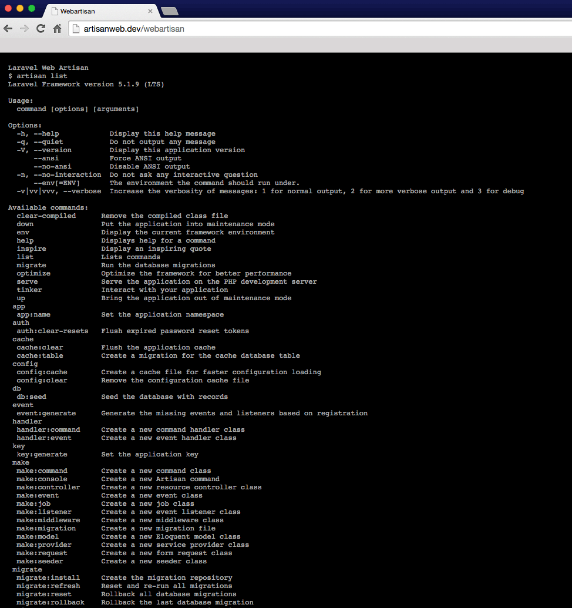

Laravel 5 Web Artisan
=================

Web artisan allows to run `artisan` console commands using a browser. Laravel port for [samdark/yii2-webshell](https://github.com/samdark/yii2-webshell).



Installation
------------

Require this package with composer:

```
composer require emir/laravel-webartisan
```

After updating composer, because of the security reasons you need to check environment is local.
So you can add the ServiceProvider to app/Providers/AppServiceProvider.php like this:

```php
public function register()
{
	if ($this->app->environment() == 'local') {
		$this->app->register('Emir\Webartisan\WebartisanServiceProvider');
	}
}
```

Copy the package assets to your local with the publish command:

```php
php artisan vendor:publish --provider="Emir\Webartisan\WebartisanServiceProvider"
```

Usage
------------

After installation you will be able to access web artisan in your browser using
the URL:

`http://localhost/path/to/artisan`

License
-------------

[MIT License](http://emir.mit-license.org/)